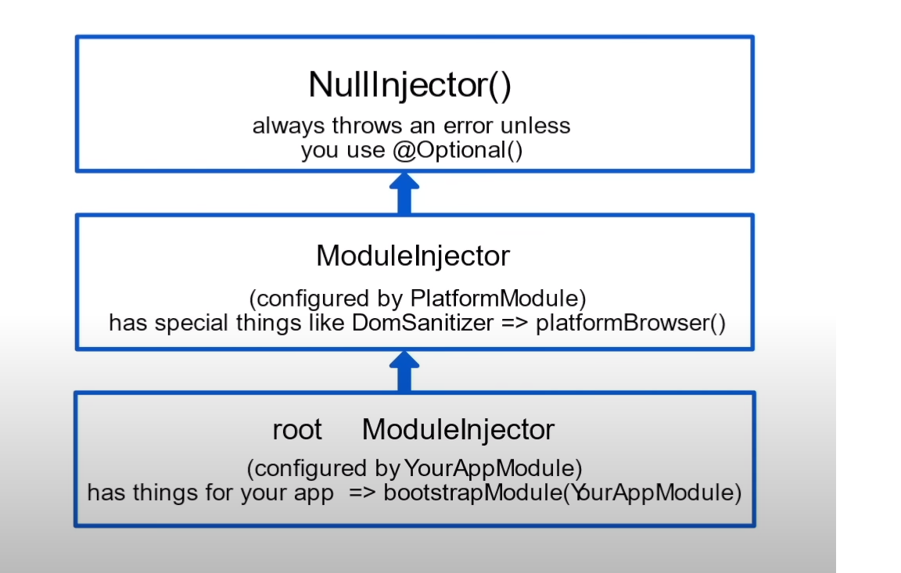

\***\*\*\*\*\*\*\***\*\***\*\*\*\*\*\*\***Typescript Demo**\*\***\*\***\*\***\*\***\*\***\*\***\*\***

Typescript data type is typed like if we assign string value can then that variable considered to be string then can not assign with number or any other datatype other that string

1. Functions: Different ways to write function:

    - Arrow
    - function Declaration
    - Function Expression
    - Generic Function
    - Optional Parameter
    - Required Parameter

2. Classes:

    - Introduction to calsses
    - Creating classes
    - Class Properties and constructor
    - Class Methods
    - Creating Instances of class
    - Memeber visibility
    - Static Members

3. Interface:

    - Create Interfaces
    - Using Interfaces as Types
    - Implementing Interface
    - Extending Interfaces
    - object destructuring
    - Array Destructuring
    - rest operator

4. Modules:
    - ES Modules
    - import/export
    - Compiling Typescripts to different JS version

\***\*\*\*\*\*\*\***\*\*\*\***\*\*\*\*\*\*\***Angular Basics**\*\***\*\*\*\***\*\***\***\*\***\*\*\*\***\*\***

1. Setup & Installation :
    - Installation Angular CLI 13.0.1
    - Create new empty workspace using CLI
    - Create a workspace with default app
    - Workspace walkthrough
    - Introduction to mono-repo

-   Create Empty Workspace using cmd

    -   $ ng new hotelinventoryapp --createApplication=false

-   Then Add app in it

    -   $ ng g app hotelinventory

-   Also We can create workspace with default app this is we generally use in day to day life

    -   $ ng new hotelinventory

-   Walkthrought of workspace

1. src/ : all code based files presents here

    - polyfills.ts: Typescript file can be compiled down to any version of javascript but here does all browser support all version of javascript so ans is NO so to make it compatible require this file

    - main.ts: Entry points of app

2. node_modules: installed packages

3. package.json: Required package required to run an app

    - dependencies: any pacakages required for production up in running comes under this.
    - devdependencies: any packages required for development purpose.

4. tsconfig.app.json: having .ts conf as same as tsconfig.json file.

5. tsconfig.json: configuration of .ts (Typescript) files.

6. angular.json: information about angular workspaces.

7. karma.conf.json: configuration for testing which is default .

8. Introduction to Mono-repo :
    - Create and maintain multiple apps in same repo.
    - Use Libraries within the project.
    - Deploy Multiple apps/libs from same repo.
    - Easy to share code within the project.

-   We can share libraries with in apps also we can deploy multiple apps with same monorepo.
-   It also helps of sharing code with one another easy

3. Create component:

    - $ ng g c <component name>

4. Binding Syntax:

    - Interpolation - {{}}
    - Property binding - []
    - Event Binding - ()

5. Directives:

    - Introduction:
        - Directives are use to change behavior and appearance of DOM element.
        - Directives can implement all lifecycle hooks.
        - Directives can not have template.
    - Types of Directives
        - Structural Directives
        - Attribute Directives
    - Built-in Directives
        - *ngIf, *ngFor, \*ngSwitch, ngClass, ngStyles

6. Pipes :

    - Introduction
        - Pipes are used for data transformation
        - Pipes donn't change actual object
    - Built-in Pipes
      Date, UpperCase, LowerCase, Currency, Decimal, Percent, Json, Slice, Async

7. Add Bootstrap using Style.css and angular.json files

\***\*\*\*\*\*\*\***\*\*\*\***\*\*\*\*\*\*\***Angular Intermediate Level 1**\*\***\*\*\*\***\*\***\***\*\***\*\*\*\***\*\***

8. Lifecycle Hooks

    - Component instance has lifecycle hooks which can help you to hook into different evets On component.
    - Life cycle ends when component is destroyed

    - ngOnChanges, ngOnInit, ngDoCheck, ngAfterContentInit, ngAfterContentChecked, ngAfterViewInit, ngAfterViewChecked, ngOnDestroy

9. Ways of component communication

    - Input/Output decorator
    - Viewchild decorator
    - Services

10. ChangeDetection:

    - As data updates so related view also get update called as change detection
    - We also can apply changedetection strategy mannually in @Componenet decorator
    - We have two option to do that

    - Default:
    - OnPush: It should Only apply to those component having no change internally like itself component is not changing data either parents.

    @Component({ 
    selector: 'hinv-rooms-list', 
    templateUrl: './rooms-list.component.html', 
    styleUrls: ['./rooms-list.component.scss'], 
    changeDetection: ChangeDetectionStrategy.OnPush, 
    }) 

    - ONPUSH : Here We should follow the concept called immutability if onpush strategy applied on child component

    - Remember if any modified array (using push) we pass to child component the view will not be update
    - We require the new instance of array only

11. ngAfterViewInit: always execute after view rendered and we should use when we use @viewChild decorator

-   Here is some catch that you will always have one error in console due to double check in dev mode and you can ignore it

-   MOST IMP: Suppose we instantiate component (headercomponent) using viewchild decorator in parent component (roomscomponent) and use static property true then It is consider that header component having no Asyncronous programming so we are free to use that instance in ngOninit of parent component

-   If instantiate(header component) having Asyncronous program then we should not use static property becuse bydefult it is false and use that instance in ngAfterViewInit() parent component

-   If we use template ref (ngTemplate with #variale ) use read property of viewchild decorator :pls check app.component.html

-   If multilple component is rendered in one html using <hinv-header></hinv-header> <hinv-header></hinv-header> so we can get that list of components using @viewChildren decorator and type would be queryList<HeaderComponent>

-   Dynamically loading component using viewContainerRef.createComponent check exp in app component

-   If any component rendered more than one time using <hinv-header></hinv-header> then we should using viewChildren decorator

12. Template Refrence

**\*\*\*\***\***\*\*\*\***Angular InterMediate Level 2**\*\*\*\***\*\***\*\*\*\***\*\*\***\*\*\*\***\*\***\*\*\*\***

13. Dependency Injection

    -   Introduction
        -   Dependencies are service or objects needed by classes to perform some function
        -   It's a design pattern
        -   Angular has built-in Dependency injection support
    -   Component Interaction Using Service

        -   Sharing data between multiple components
        -   Sharing data within App

    -   Resolution Modifiers

        -   self Decorator: As we add self decorator with service in a component ex employee component then angular will search that service in current employee folder location if it is not found will raise Null injector error insted of going app moudle or something else

        -   skip slef decorator: If the service injected using skipself decorator then angular want the service to be placed above the current postion of component other wise raise an error you can check rooms.component.ts file

        -   Optional decorator: If the service is injected using optional decorator then It indicates that if service is present then only execute otherwise skip that
            -   Use case schenario: when if we want that service available in dev but not in production in such time we use this (Logger.service.ts)

    -   DI Providers
        -   Class based providers
            -   ng g s <service-name>
            -   Injecting a service
            -   Consuming a service
            -   root:
                -   In old days we have to register service in providers array of app module and issue here was if we not using that service by any chance still that service gets bundeled.
                -   Solution were to use provided in root inside @Injectable decorator which means the same but if we are not using that service does not let add servie in bundled.
                -   root also means that It will create only single instance of a service no matter how many time of service class instantiate you can check to write console in service class constructor.(rooms.service.js)
                -   Flow Dig
                    </img>
            -   any: it creates multiple instances of a service if provider set to be any you can check config service created instances
        -   VALUE PROVIDERS: VERY IMPORTANT CONCEPTS
            -   If any resource that we don't want to use directly due to the risk of modification or something else we should use value provider concept and genrally we use @Inject() decorator
            -   Go to appconfig.service.ts file to verify and how it is use
            -   Also we can do the same for using localstorage API
        -   Factory

14. Angular HTTP Request Module

    -   Introduction:
        -   In enterprise apps, You need to interact with API's
        -   You may be familiar with ajax,fetch
        -   HttpClient Service Provided by Angular to interact with API's
        -   HttpClient internally uses RXJS
    -   Setting Up HttpClient
        -   We need to import HttpClientModule
        -   Once module is imported we can inject HttpClient Service
    -   Using HttpClient Service
    -   Rxjs, Observable and streams
        -   RXJS is an library for writing Reactive Programming
        -   Observable are stream of data to which we can subscribe
            -   Observable : It bradcast the stream of data
            -   Observer : It checks wether the data has changed if yes then calls the next() method internally and in subscribtion we can get the new data
    -   http methods
        -   GET, PUT, POST, DELETE
    -   HTTPRequest API: When you want full control on requesting api like if you want to do something on these folowing event happens then you can do insted of using http.get() method becouse it does not gives this controls
        -   Request send: notfication card having req send msg
        -   Data loading: show some loaded data first
        -   Download progress: show loading symbol
        -   Response: show response body once get
        -   check the roomcomponent.ts ngoninit
    -   async Pipe: If the data is only we want to get and we subscribe has to unsubscribe as well so the best way to do it is to use async pipe which make subscribe and unsubscribe as well
        -   Remember async pipe can return null so handle accordingly
        -   Try to avoid multiple async pipe in one html rather you can use alias and use that alias
            -   roomsList$ | async as rooms
    -   Rxjs Operator:
        -   shareReply: It help to cash the request so you don't have to request again if request made more than one time
        -   catchError: It helps to handle error if api response Error response
        -   subject: It act as observable and observer as well
            -Map: modify the stream of data using this
    -   Http Interceptors:
        -   Allow us to intercept every request
        -   We can change data and add headers
        -   {
            provide: HTTP_INTERCEPTORS,
            useClass: RequestInterceptor,
            multi: true
            }
        -   HTTP_INTERCEPTORS it is a service use for intercepting request
        -   Angular itself add many interceptor in request and also we can add interceptor in it
        -   Interceptor only works sequencially in case you have multiple interceptors
        -   we can intercept request only for POST method or PUT method or GET method check this RequestInterceptor
    -   APP_INITIALIZERS
        -   APP_INITIALIZER allow you to inject function as applications startup or initialize

15. Angular Router

    -   Introduction
        -   Provides the functionality to add Routes
        -   Developers can configure all the routes at Front-End
        -   Provides SPA functionality
        -   Feature to add nested routes
    -   Setup Router
        -   Import RouterModule
        -   forRoot method allows us to add multiple route config
        -   Default route : empty url should redirect ex - { path: '', redirectTo :'/rooms', pathMatch: 'full' },
        -   Dynamic route
        -   Wild card route: the url given not present in routes should be redirect to error page
    -   Note : While using routerLink directive always use '/' before url because it indicates that url should starts from there and if you remove slash '/' you would see the url got append in previous url
    -   Using ActivatedRoute Service
        -   Allow to read the router data.
            -   params: API we generally use to get one dynamic route value
            -   paramsMap: API we generally use if we have multiple dynamic route value
                -   It has multiple methods which sometime imp
                -   has: checks wether perticular key exist or not
                -   get: get the key value
                -   getAll: get all keys values
        -   Allow access to snapshot data.
        -   Allows to access data from Route Config.
    -   Using Router Service
    -   Feature Module and Routing
    -   Nested Routing and Child Routes
    -   Lazy Loading
    -   Route Guards

16. Template Driven forms

    -   Setting Up Template Driven Forms
        -   Import FormsModule to module.
        -   In template Driven forms we create Forms HTML Tag.
        -   Good for Developers who likes to have more control using HTML.
        -   Use ngModel for 2 way data binding.
    -   Validating Forms
        -   Use HTML5 validation to validate Forms.
        -   Use disabled property to avoid submitting blank forms.
        -   Use #templateVariable to access the state of Forms.
    -   Submit and Reset Forms - resetForm({}) : pass the default data also if you reset it
    -   Custom Directives with Forms
        -   ng g d hover
        -   Change behavior of DOM on hover
            -   We can change the property of element using rendere2 API
    -   Custom Pipe demo with Forms
    -   Writing a custom directive
        -   hover is custom directive
        -   Use HostListener to listen to events
            -   It helps to improve the styles or functionality of dom element so It is more like a helper function
    -   Writing custom validator
        -   Write custom validator for template driven forms.
            -   use Validator interface to use custom validators
        -   Add logic to validate the Form Field
            -   Put logic in it and pass object { [key] : true/false } accordingly

17. Router Service

    -   Access the ROuter events
    -   Navigate using Router Service

18. Feature Module and Routing

    -   Creating Feature Module
        -   Generally use this feature module to store the related functionality at one place
        -   ng g m <module-name> --flat=ture --routing=true
        -   mention the components which is required for that module
        -   MOST IMP: You can not mention one component which is alredy mentioned in any of the module
        -   if any component is used other than current module or folder then that component has to export and use that module name not the component name
    -   Configure routing at Feature module level
        -   Always Register feature module before the App routing module if that feature module have its own routes😊
    -   forChild used to configure the routes

19. Lazy Loading

    -   Allow to split the code at module level.
        -   the module should have everything that needed and once we call that module should perform accordingly
        -   Don't mentioned any component which can be use by other module so that you would have to use that module again
            -   ex: header component is use in roomsmodule and employee module so if you have mentioned in only roommodule then you have to import it inside employee module as well which fails the concept of lazy loading
    -   Load code when user need it.
        -   Module should be isolated.
    -   Reduce main bundle size.

    -   Cmd for creating module with routing file and registered in appmodule which is lazyload
        -   $ ng g m booking --route=booking --routing --module=app
    -   cmd for creating module first then component which is not lazyload
        -   $ ng g m search
        -   $ ng g c search // this will be registered in search module directly

20. Route Guards
    -   canActivate
        -   Generally use to restrict user from routing to that component
    -   canActivateChild
        -   Generally use to restrict user from routing to that child component
    -   canDeactivate
    -   canLoad
        -   It only used in lazy loading even if you are restriceted to that module but if you click and try to visit that module the code gets loads in DOM so to restrict from lazy loaded module in DOM we should use this canload interface impleted for roomsmodule in app.
    -   Resolve
